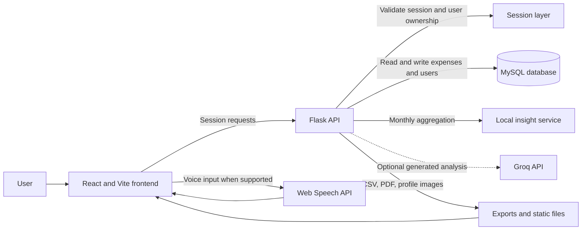

# NOVA Expense Tracker

NOVA Expense Tracker is a full-stack personal finance application for recording, reviewing, and understanding day-to-day spending. It combines a React dashboard with a Flask API, MySQL persistence, downloadable reports, an interactive expense assistant, and optional Groq-powered financial analysis.

## Highlights

- Session-based registration, login, and logout
- Manual expense creation, editing, and deletion
- Natural-language expense entry through the Nova assistant
- Browser speech input where Web Speech API support is available
- Automatic category and payment-mode detection for chatbot entries
- Dashboard totals for all-time, current-month, and transaction-count views
- Weekly, monthly, and yearly analytics with category breakdowns
- Calendar view with daily expense details
- CSV and PDF report downloads
- Profile information and profile-picture upload
- Financial, budget, savings, and spending analysis pages
- Responsive layout for desktop and mobile screens

## Live Links

- **Live Application:** https://nova-expense-tracker-six.vercel.app
- **Live Backend API (Render):** https://nova-expense-tracker.onrender.com
- **Backend Health Check:** https://nova-expense-tracker.onrender.com/api/health
- **GitHub Repository:** https://github.com/akankshavishwasrao3000/NOVA-Expense-Tracker

## Live Deployment

| Component | Platform | Details |
| --- | --- | --- |
| Frontend | **Vercel** | Static React/Vite build deployed from the `frontend/dist` directory |
| Backend API | **Render** | Flask application served via Gunicorn with environment-based configuration |
| Database | **Aiven MySQL** | Managed cloud MySQL; Flask connects using `MYSQL_*` environment variables set on Render |
| Source Control | **GitHub** | Single repository containing both `backend/` and `frontend/` directories |

All environment variables (database credentials, `SECRET_KEY`, `GROQ_API_KEY`, `FRONTEND_ORIGINS`) are configured in each platform's environment settings and are never committed to the repository.

## Technology

| Layer | Technology |
| --- | --- |
| Frontend | React 19, Vite, JavaScript, CSS |
| Backend | Python, Flask 3, Flask-CORS |
| Database | MySQL (Aiven MySQL in production) |
| Authentication | Flask server-side sessions and Werkzeug password hashing |
| Reports | ReportLab and Python CSV utilities |
| AI | Groq API, with local monthly expense aggregation |
| Voice input | Browser Web Speech API |
| Hosting | Vercel (frontend), Render (backend), Aiven (database), GitHub (source) |

## Architecture

The browser communicates with Flask through the `/api` endpoints. **React does not connect directly to MySQL.** Flask validates the session, reads and writes user-owned records, and returns JSON responses. Profile images are served from Flask's `backend/static/profile_pics` directory.

### Production Architecture

```text
┌─────────────────┐       HTTPS        ┌────────────────────┐       MySQL       ┌──────────────────┐
│  Vercel          │  ←─────────────→  │  Render             │  ←─────────────→  │  Aiven MySQL     │
│  (React build)   │  VITE_API_URL     │  (Flask + Gunicorn) │  MYSQL_* env vars │  (managed cloud) │
└─────────────────┘                    └────────────────────┘                    └──────────────────┘
                                              │
                                              ├── GROQ_API_KEY ──→ Groq API (optional)
                                              └── Static files (profile pics, exports)
```

- The Vercel-hosted React build sends all API requests to the Render backend URL (`VITE_API_URL`).
- Render runs Flask behind Gunicorn. All database credentials (`MYSQL_HOST`, `MYSQL_PORT`, etc.) point to the Aiven MySQL instance.
- Aiven provides a managed MySQL database accessible over TLS.
- The Groq API is called only when `GROQ_API_KEY` is configured and the user requests an AI-generated analysis.

## Why We Built This Project

Many people record expenses but do not turn those records into useful decisions. NOVA was built to make personal finance tracking more practical, accessible, and understandable by bringing everyday entry, visual reporting, conversational assistance, and financial analysis into one application.

The project also provides a realistic full-stack engineering experience. It connects a responsive React interface to a Flask API, a relational MySQL database, secure password handling, session-based access control, file uploads, downloadable reports, browser speech input, and optional generative AI. This makes the project useful both as a personal finance tool and as a final-year software engineering project.

## Advantages

- **Less friction:** Users can enter expenses through a form, text, or supported voice input.
- **Actionable visibility:** Dashboard totals, analytics charts, calendar history, and category breakdowns make spending patterns easier to understand.
- **Conversational control:** Nova supports commands for adding, viewing, updating, and deleting expenses, as well as budget and summary requests.
- **Personalized analysis:** Local monthly aggregation works without an AI provider, while Groq can generate detailed financial, budget, savings, and spending guidance.
- **Complete ownership of data:** The frontend communicates through a controlled Flask API, and records are isolated by authenticated user ID.
- **Useful exports:** CSV and PDF reports make it easier to archive, share, or review financial activity outside the application.
- **Extensible foundation:** The separated frontend, backend, database, and AI service can evolve independently.

## Project Evolution: Earlier Approach vs NOVA

The earlier column describes the common capabilities of a basic or earlier expense-tracker implementation. The comparison is based on the current repository's verified functionality; earlier project source files were not included in this workspace.

| Area | Basic or earlier expense tracker | Recent NOVA implementation |
| --- | --- | --- |
| User interface | A small form and a simple list | Responsive React dashboard with dedicated analytics, calendar, profile, history, and AI views |
| Data entry | Manual form submission | Manual entry plus natural-language and browser speech input |
| Storage | Local or tightly coupled persistence | Flask API with MySQL and a separate migration utility |
| Authentication | Minimal or no account separation | Session login, signup, logout, hashed passwords, and user-scoped queries |
| Insights | Basic totals | Weekly, monthly, yearly, category, calendar, and current-month AI insights |
| Reports | On-screen records only | CSV and PDF downloads |
| Assistant | No assistant or fixed actions | Nova commands for expense entry, summaries, budgets, updates, and deletion |
| Profile | No profile management | Account details and profile-picture upload |
| Architecture | Monolithic or tightly coupled code | React frontend, Flask API, database helpers, AI service, and configurable environments |
| Deployment readiness | Primarily local development | Production-oriented CORS configuration, Gunicorn support, Vite build, and environment-based settings |

This evolution moves the project from a basic record-keeping tool toward a more complete personal finance platform. It improves convenience for users while also demonstrating stronger separation of concerns and more realistic application architecture.

```text
expense_tracker/
├── backend/
│   ├── app.py                     Flask application and API routes
│   ├── ai_service.py              Monthly summaries and Groq analysis
│   ├── database.py                MySQL connection helpers
│   ├── migrate_sqlite_to_mysql.py One-time SQLite import utility
│   ├── requirements.txt            Python dependencies
│   ├── config/
│   │   └── config.py              Environment configuration
│   └── static/profile_pics/       Uploaded profile images
├── frontend/
│   ├── src/
│   │   ├── components/             Reusable UI components
│   │   ├── pages/                  Dashboard, analytics, profile, and AI views
│   │   ├── services/api.js         Fetch client for Flask
│   │   └── styles/                 Application styles
│   ├── package.json
│   └── vite.config.js              Development proxy configuration
├── .gitignore
└── README.md
```

## Application Workflow

### User journey

1. A new user creates an account with a username, email address, and password.
2. The user logs in and receives a Flask session.
3. The dashboard loads the user's totals and expense history.
4. The user records expenses manually or asks Nova to create one using natural language or speech input.
5. Flask validates the request, classifies chatbot entries when needed, and stores the expense in MySQL.
6. The dashboard refreshes after a successful create, update, or delete operation.
7. The user reviews spending through weekly, monthly, yearly, calendar, and AI views.
8. The user downloads a CSV or PDF report and can update their profile picture from the Profile page.
9. The user logs out, which clears the server-side session.

### Request and data flow



### Expense entry flow

Manual entries send date, category, description, amount, payment mode, and entry type to `POST /api/expenses`. Chatbot entries send a natural-language message to `POST /api/chatbot`; Flask extracts the amount, date, category, and payment mode before saving it with `entry_type` set to `Chatbot`.

### Analysis flow

The AI pages first request local monthly aggregates from `GET /api/ai/<type>`. When the user selects **Generate analysis**, the frontend sends `POST /api/ai/<type>`. Flask formats the current user's aggregates and calls Groq when `GROQ_API_KEY` is configured. Without a Groq key, local summaries continue to work but generated narrative analysis is unavailable.

## Requirements

- Python 3.10 or newer
- Node.js 18 or newer and npm
- MySQL 8 or a compatible MySQL server
- A modern browser; speech input requires browser support for `SpeechRecognition` or `webkitSpeechRecognition`
- Optional: a Groq API key for generated AI reports

## Local Setup

### 1. Create the MySQL database

Create a database and a dedicated application user using MySQL Workbench or the MySQL client:

```sql
CREATE DATABASE expense_tracker;
CREATE USER 'expense_tracker_user'@'localhost' IDENTIFIED BY 'choose-a-password';
GRANT ALL PRIVILEGES ON expense_tracker.* TO 'expense_tracker_user'@'localhost';
FLUSH PRIVILEGES;
```

The Flask application creates the `users` and `expenses` tables on startup when the configured database is reachable.

### 2. Configure and start the backend

From the repository root, create a virtual environment and install the backend dependencies:

```powershell
python -m venv .venv
.\.venv\Scripts\Activate.ps1
cd backend
pip install -r requirements.txt
Copy-Item .env.example .env
```

Edit `backend/.env` with the MySQL values for your machine. A minimal local configuration is:

```dotenv
SECRET_KEY=replace-with-a-long-random-secret
MYSQL_HOST=127.0.0.1
MYSQL_PORT=3306
MYSQL_DATABASE=expense_tracker
MYSQL_USER=expense_tracker_user
MYSQL_PASSWORD=your-local-mysql-password
GROQ_API_KEY=replace-me
FRONTEND_ORIGINS=http://localhost:5173,http://127.0.0.1:5173
PORT=5000
FLASK_DEBUG=false
```

Start Flask from the `backend` directory:

```powershell
python app.py
```

The API is available at `http://127.0.0.1:5000`.

### 3. Configure and start the frontend

Open a second terminal at the repository root:

```powershell
cd frontend
npm install
Copy-Item .env.example .env
npm run dev
```

The Vite development server normally runs at `http://localhost:5173`. The Vite proxy forwards `/api`, `/static`, `/export-csv`, and `/export-pdf` requests to Flask during local development.

The frontend environment file contains:

```dotenv
VITE_API_URL=http://127.0.0.1:5000
```

When using the Vite proxy, leaving `VITE_API_URL` empty is also valid. For a deployed frontend, set it to the public Flask API URL.

## Useful Commands

Run these from `frontend/`:

```powershell
npm run dev       # Start the Vite development server
npm run build     # Create a production build in frontend/dist
npm run preview   # Preview the production build locally
npm run lint      # Run ESLint
```

Run these from `backend/`:

```powershell
python app.py     # Start Flask and initialize the MySQL tables
```

## Database Migration

The runtime application uses MySQL. If an older SQLite database exists, the migration utility can copy its users and expenses into the configured MySQL database:

```powershell
cd backend
python migrate_sqlite_to_mysql.py
```

The script reads `expense_tracker.db` by default, or the path in `SQLITE_PATH`. It preserves IDs and relationships, uses upsert behavior, and does not modify or delete the SQLite source.

## API Reference

All protected routes require an authenticated Flask session. The frontend sends credentials with every request.

| Method | Endpoint | Purpose |
| --- | --- | --- |
| `GET` | `/api/health` | Check that Flask is running |
| `GET` | `/api/health/db` | Check MySQL connectivity |
| `GET` | `/api/auth/session` | Read the current session |
| `POST` | `/api/auth/signup` | Create an account |
| `POST` | `/api/auth/login` | Start a session |
| `POST` | `/api/auth/logout` | Clear the session |
| `GET` | `/api/dashboard` | Load dashboard totals and expenses |
| `GET`, `POST` | `/api/expenses` | List or create expenses |
| `PUT`, `DELETE` | `/api/expenses/<id>` | Update or delete an expense |
| `GET` | `/api/analytics/<period>` | Load `weekly`, `monthly`, or `yearly` analytics |
| `GET` | `/api/calendar` | Load expense totals by date |
| `GET` | `/api/calendar/<date>` | Load expenses for a date |
| `POST` | `/api/chatbot` | Process assistant commands or add an expense |
| `GET` | `/api/profile` | Load the current profile |
| `POST` | `/api/profile/picture` | Upload a profile picture |
| `GET`, `POST` | `/api/ai/<type>` | Load insights or generate `financial`, `budget`, `savings`, or `spending` analysis |
| `GET` | `/export-csv` | Download the user's expenses as CSV |
| `GET` | `/export-pdf` | Download the user's expenses as PDF |

## Nova Assistant Examples

The assistant accepts commands such as:

```text
I spent 200 on pizza today using UPI
Show today expenses
Show this month expenses
Update 1 to 500
Delete 2
Summary
Set budget 5000
Show budget
```

Natural-language entries are classified using keyword matching. Supported examples include food, transport, shopping, entertainment, health, education, groceries, rent, and bills. Amounts may be numeric or written as supported thousand-value phrases.

## Health Checks

After starting Flask, verify the services in a browser or with a request client:

```text
GET http://127.0.0.1:5000/api/health
GET http://127.0.0.1:5000/api/health/db
```

The database check returns `mysql` only when Flask can connect successfully using all required MySQL environment variables.

## Deployment Notes

### Backend

Run Flask behind a production WSGI server such as Gunicorn:

```bash
gunicorn --bind 0.0.0.0:$PORT app:app
```

Configure the production MySQL host, credentials, `SECRET_KEY`, `FRONTEND_ORIGINS`, and optional `GROQ_API_KEY` in the hosting provider's environment settings. Do not commit `.env` files or secrets.

### Frontend

Build the Vite application and serve the generated `frontend/dist` directory:

```bash
npm run build
```

Set `VITE_API_URL` to the public backend URL. The frontend must not contain MySQL credentials, Flask secrets, or Groq secrets.

## Security and Operational Notes

- Passwords are stored using Werkzeug password hashing rather than plain text.
- Session cookies are sent with `credentials: 'include'`, and CORS is restricted by `FRONTEND_ORIGINS`.
- Each protected query is scoped to the authenticated user's ID.
- Replace the development `SECRET_KEY` before any shared or production deployment.
- Never commit `backend/.env`, API keys, database passwords, or uploaded user data.
- If a credential has ever been exposed, revoke and rotate it before continuing development.
- Budget values are currently held in backend process memory and reset when the process restarts.
- AI-generated analysis requires a configured Groq key; monthly insight aggregation works without one.

## Current Limitations

- There is no automated test suite or CI configuration in the repository yet.
- The application currently uses session authentication rather than JWT tokens.
- Profile uploads are saved with a fixed per-user PNG filename and should be hardened with file validation before production use.
- The backend requires MySQL environment variables and does not use SQLite as its runtime database.

## Future Implementation

The next development phase can focus on reliability, security, and long-term user value:

- Add automated backend and frontend tests, API contract tests, and CI checks.
- Persist monthly budgets in MySQL instead of process memory and add configurable budget alerts.
- Add stronger upload validation, file-size limits, image resizing, and safer generated filenames.
- Add CSRF protection, secure production cookie settings, rate limiting, and account recovery.
- Add recurring expenses, custom categories, multiple currencies, and richer filtering.
- Add trend comparisons, savings goals, and interactive budget-versus-actual dashboards.
- Add streaming or background processing for longer AI reports and record AI usage status clearly.
- Add database migrations, structured logging, monitoring, and backup/restore procedures.
- Add role-based access only if shared household or team accounts become a product requirement.
- Add a mobile-first PWA or native mobile client using the existing API contracts.

## Project Authors

- Akanksha Vishwasrao - B.E. Computer Engineering
- Apeksha Vishwasrao - B.E. Computer Engineering

Built as a final-year B.E. Computer Engineering project.
